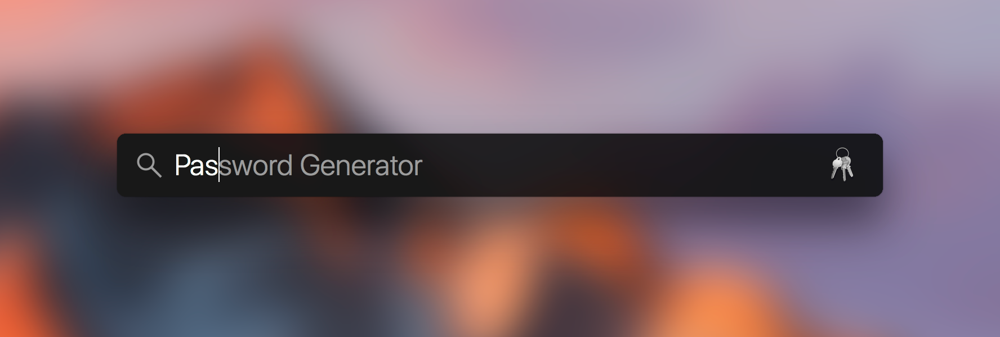

# Password Generator

A super convenient AppleScript app to generate passwords similar to iCloud
Keychain suggested passwords.

## Usage

1. Launch with Spotlight:



2. A password is displayed and copied to your clipboard:


3. Dismiss by hitting `enter`, or click `Another Password`.


## Install

````
git clone https://github.com/chrstphrknwtn/password-generator.git
cd password-generator
install.sh
````
